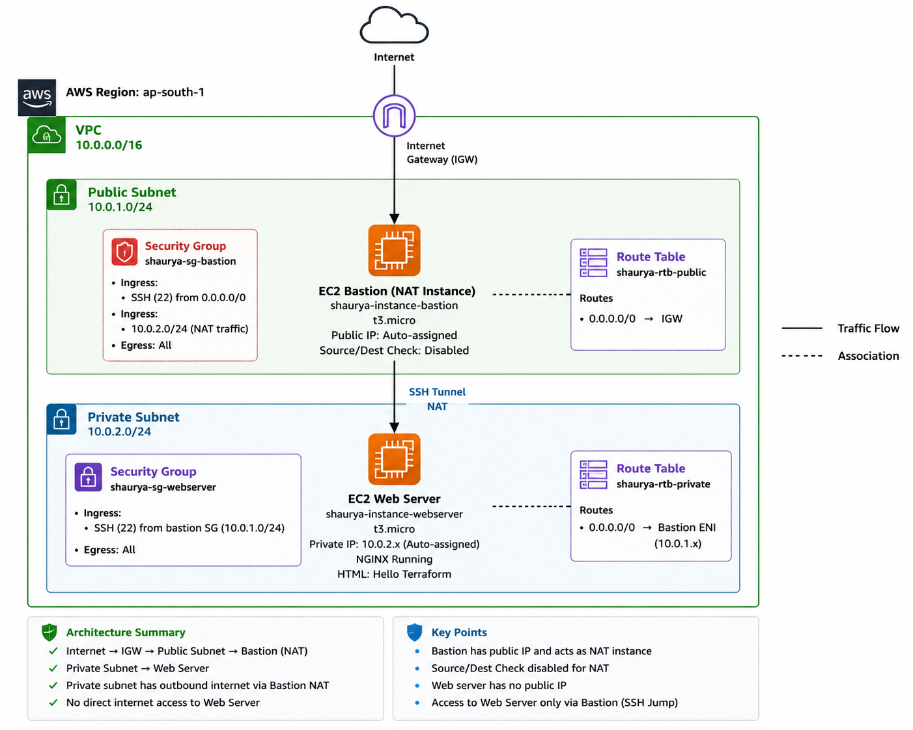
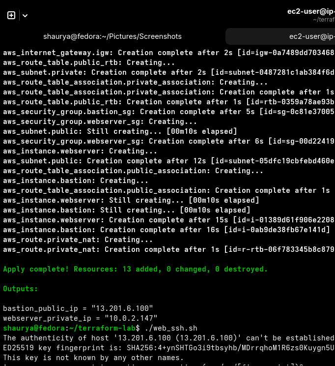
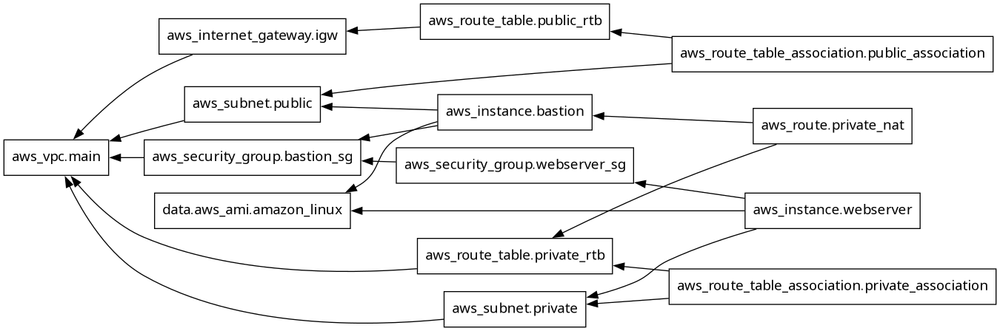
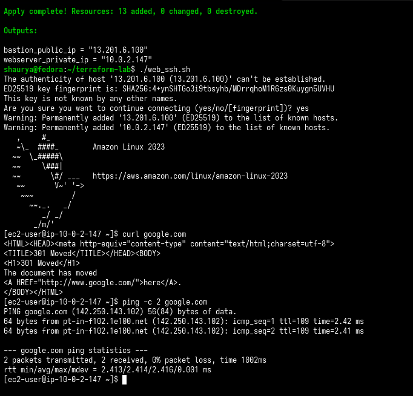
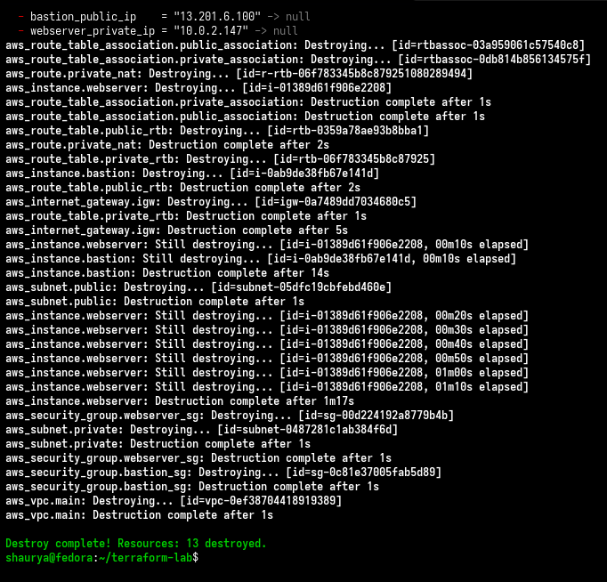

# terraform-aws-bastion-nat

A single-region AWS network — VPC, public/private subnets, bastion-as-NAT, and a private web server — provisioned entirely with Terraform. No console, no manual resource creation.

This is a rebuild of an architecture I first stood up by hand with the AWS CLI ([aws-infra-cli](https://github.com/shaurya-security/aws-infra-cli)). Same topology, this time expressed declaratively: dependency order is enforced by the graph instead of remembered by me.

---

## Architecture



- VPC `10.0.0.0/16` in `ap-south-1`
- Public subnet `10.0.1.0/24` (`ap-south-1a`) → Bastion EC2, public IP, doubles as a NAT instance
- Private subnet `10.0.2.0/24` (`ap-south-1b`) → Web server EC2, no public IP, NGINX
- Internet Gateway on the public route table; private route table's default route points at the bastion's ENI
- Security groups chained: SSH reaches the bastion from anywhere, the web server only accepts SSH from the bastion's SG
- No managed NAT Gateway — the bastion does the NAT work itself via `iptables MASQUERADE`

---

## Features

- **Fully declarative lifecycle** — 13 resources, one `terraform apply` / `terraform destroy`, no drift between runs
- **Dynamic AMI resolution** — `data.aws_ami` filters for the latest Amazon Linux 2023 image at apply time instead of a hardcoded, decaying AMI ID
- **Bastion-as-NAT** — `source_dest_check` disabled on the bastion, `iptables` MASQUERADE rule injected via `user_data`, rules persisted across reboot with a hand-written systemd unit (AL2023 dropped the `iptables-services` package this used to rely on)
- **Centralized naming** — all resource names derive from one `owner` local, so a naming-convention change is a one-line edit
- **Zero-copy-paste access** — `bastion_ssh.sh` and `web_ssh.sh` read `terraform output` directly and jump-host into the private instance with agent forwarding

---

## Project structure

```
terraform-lab/
├── main.tf          # provider + required_providers
├── variables.tf     # CIDR ranges, owner prefix
├── locals.tf         # naming convention (owner → resource names)
├── data.tf           # latest Amazon Linux 2023 AMI lookup
├── network.tf        # VPC, subnets, IGW, route tables, security groups, NAT route
├── compute.tf         # bastion + web server instances, user_data
├── output.tf         # bastion_public_ip, webserver_private_ip
├── bastion_ssh.sh    # direct SSH to the bastion
└── web_ssh.sh        # SSH jump through the bastion to the private web server
```

---

## Screenshots

**`terraform apply`** — 13 resources created, outputs printed:



**`terraform graph`** — dependency order enforced by Terraform, not memory:



**SSH jump + NAT proof** — from the private web server, with no public IP, straight through the bastion:



**`terraform destroy`** — full teardown, 13 resources removed, correct reverse order:



---

## Deployment

**Prerequisites**
- Terraform >= 1.5, AWS provider `~> 6.0`
- AWS CLI v2 configured with credentials for `ap-south-1`
- An EC2 key pair named `shaurya-bastion-key` already created in that region (or edit `key_name` in `compute.tf`)

```bash
git clone https://github.com/shaurya-security/terraform-aws-bastion-nat.git
cd terraform-lab

terraform init
terraform plan
terraform apply

# jump into the private web server through the bastion
chmod +x bastion_ssh.sh web_ssh.sh
./web_ssh.sh

# tear it all down
terraform destroy
```

---

## Lessons learned

- **AL2023 dropped `iptables-services`.** The package this project originally leaned on for persisting iptables rules across reboot doesn't exist on Amazon Linux 2023. Fixed by writing rules with `iptables-save` and restoring them at boot through a custom `oneshot` systemd unit instead.
- **`source_dest_check` isn't optional for a NAT instance.** Left at its default (`true`), AWS drops any traffic the bastion is forwarding rather than originating — MASQUERADE traffic silently disappears until this is turned off explicitly.
- **The route to a NAT instance is a live dependency, not a static value.** Pointing the private route table at `aws_instance.bastion.primary_network_interface_id` means Terraform won't create that route until the bastion exists — the graph makes an ordering constraint that was easy to get wrong by hand impossible to skip.

---

## Future improvements

- [ ] Variablize `key_name` and AMI filters instead of hardcoding
- [ ] Remote state (S3 backend + DynamoDB locking)
- [ ] Toggle between bastion-as-NAT and a managed NAT Gateway via a variable
- [ ] CloudTrail + VPC Flow Logs feeding into the existing Wazuh detection pipeline
- [ ] Checkov scan in CI
- [ ] Split `network.tf` / `compute.tf` into reusable modules

---

## License

MIT
