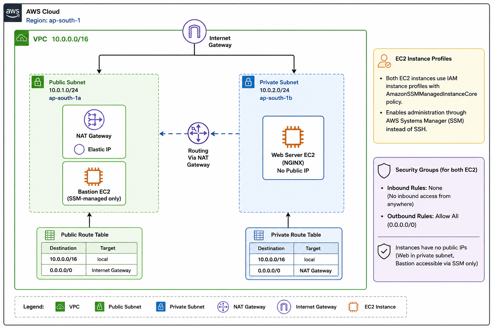
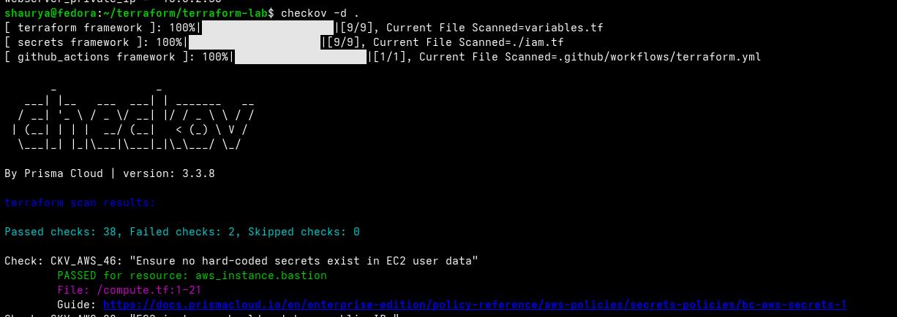

# AWS Secure VPC with Terraform

#### A production-style AWS networking lab built with Terraform featuring remote state, a managed NAT Gateway, AWS Systems Manager (SSM), GitHub Actions CI, and Checkov security scanning.

---

## Overview

This project provisions a secure, single-region AWS environment using **Terraform**.

It demonstrates modern AWS infrastructure practices by combining **Infrastructure as Code**, **private networking**, **AWS Systems Manager (SSM)**, **remote Terraform state**, and **automated security validation** through GitHub Actions and Checkov.

This repository is the second major iteration of a cloud infrastructure lab that evolved through multiple implementations:

- **v0:** AWS CLI provisioning → [aws-infra-cli](https://github.com/shaurya-security/aws-infra-cli)
- **v1:** Terraform with Bastion-as-NAT → [terraform-aws-bastion-nat](https://github.com/shaurya-security/terraform-aws-bastion-nat/tree/v1.0.0)
- **v2 (current):** Managed NAT Gateway + AWS Systems Manager (SSM)

Unlike previous versions, this implementation eliminates SSH administration entirely. Both EC2 instances are managed through **AWS Systems Manager Session Manager**, requiring **no SSH keys** and **no inbound security group rules**.

> **Note**
>
> The Bastion EC2 instance is retained solely as an SSM-managed administration host and demonstration instance. It no longer functions as a NAT instance or SSH jump host.

---

# Highlights

- ✅ Production-style VPC architecture
- ✅ Managed NAT Gateway
- ✅ Public & Private Subnets
- ✅ AWS Systems Manager (SSM)
- ✅ No SSH keys required
- ✅ No inbound Security Group rules
- ✅ IMDSv2 enforced
- ✅ Encrypted EBS root volumes
- ✅ Remote Terraform State (S3)
- ✅ Native Terraform State Locking
- ✅ GitHub Actions CI
- ✅ Checkov Security Scanning

---

# What's New in v2

| Feature | v1 | v2 |
|----------|----|----|
| NAT | Bastion EC2 (`iptables`) | Managed NAT Gateway |
| Administration | SSH Jump Host | AWS Systems Manager |
| State | Local | S3 Backend |
| Locking | None | Native `use_lockfile` |
| Security | SSH Inbound | No Inbound Rules |
| Root Volume | Default | Encrypted |
| IMDS | Optional | IMDSv2 Required |
| CI/CD | None | GitHub Actions |
| Security Scanning | None | Checkov |

---

# Architecture

## Infrastructure

- **Region:** ap-south-1
- **VPC:** `10.0.0.0/16`

### Public Subnet (`10.0.1.0/24`)

- NAT Gateway
- Elastic IP
- Bastion EC2 (SSM-managed)

### Private Subnet (`10.0.2.0/24`)

- NGINX Web Server
- No Public IP

### Networking

- Internet Gateway
- Public Route Table
- Private Route Table
- Private subnet routes Internet traffic through the NAT Gateway

### Administration

- IAM Instance Profiles
- AmazonSSMManagedInstanceCore
- AWS Systems Manager Session Manager

### Security

- No inbound Security Group rules
- Allow all outbound traffic
- IMDSv2 required
- Encrypted root volumes

<p align="center">
  
</p>

---

# Repository Structure

```text
.
├── terraform-bootstrap/
│   ├── backend.tf
│   ├── provider.tf
│   └── s3.tf
│
└── terraform-lab/
    ├── backend.tf
    ├── compute.tf
    ├── data.tf
    ├── iam.tf
    ├── locals.tf
    ├── main.tf
    ├── network.tf
    ├── output.tf
    ├── variables.tf
    ├── userdata/
    ├── ssm_bastion.sh
    ├── ssm_web.sh
    ├── .checkov.yaml
    └── .github/workflows/
        └── terraform.yml
```

---

# Deployment

## Prerequisites

- Terraform >= 1.5
- AWS Provider ~> 6.0
- AWS CLI v2
- AWS Session Manager Plugin

---

## 1. Bootstrap Remote State

```bash
cd terraform-bootstrap

terraform init

terraform apply
```

---

## 2. Deploy Infrastructure

```bash
cd terraform-lab

terraform init

terraform plan

terraform apply
```

---

## 3. Connect Through AWS Systems Manager

```bash
chmod +x ssm_bastion.sh ssm_web.sh

./ssm_bastion.sh

# or

./ssm_web.sh
```

The helper scripts automatically retrieve the EC2 Instance ID from Terraform outputs and establish an interactive Systems Manager session.

No SSH keys are required.

---

## 4. Destroy Infrastructure

```bash
terraform destroy
```

---

# CI/CD & Security Validation

Every push and pull request automatically executes:

- ✅ Terraform Formatting
- ✅ Terraform Validation
- ✅ Checkov Terraform Scan
- ✅ Checkov GitHub Actions Scan

---

## GitHub Actions Scan


---

## Checkov Terraform Scan

Current results:

- ✅ 38 Checks Passed
- ⚠️ 2 Findings Accepted (`CKV_AWS_126`)

The remaining findings relate to **EC2 Detailed Monitoring**, which has been intentionally left disabled because it represents a cost optimization rather than a security requirement.

<p align="center">
  
</p>

---

# Future Improvements

- [ ] Connect `bastion.sh` and `webserver.sh` to `user_data`
- [ ] Variable to switch between NAT Gateway and Bastion-as-NAT
- [ ] Convert networking into reusable Terraform modules
- [ ] Apply least-privilege inbound Security Group rules for deployed workloads
- [ ] Enable VPC Flow Logs and integrate with the Wazuh Detection Pipeline

---

# Related Projects

| Repository | Description |
|------------|-------------|
| **aws-infra-cli** | AWS infrastructure provisioned entirely through the AWS CLI |
| **terraform-aws-bastion-nat** | Previous Terraform implementation using a Bastion NAT Instance |
| **aws-cloud-detection-pipeline** | Detection engineering with CloudTrail, VPC Flow Logs, and Wazuh |

---

# License

This project is licensed under the **MIT License**.
